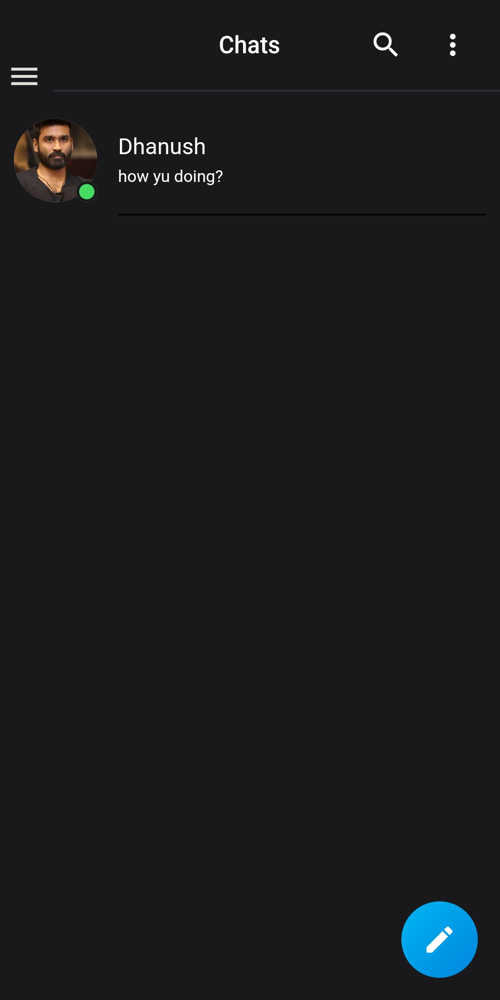

Employee Tracking is a Cross Platform App developed for college project using Flutter. The objective of the app is to track the real-time location of employees inside the campus and enable the employees to chat between them. I've referred some github repos for developing this project. Below are the screenshots of the app

  
 
 
  
 
 

